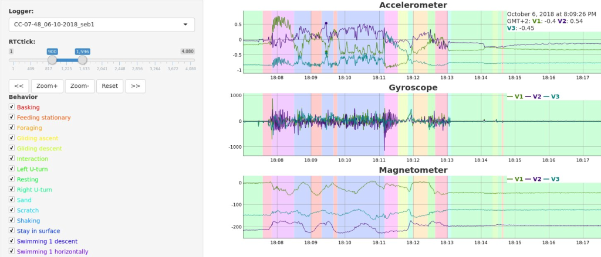

# rblt
Le package rblt R-bio-logging-toolbox est une librairie de fonctions R de visualisation des données accéléros des bio-loggers CATS, des  bio-loggers WACU qui sont fabriqués par le service MIBE de l’IPHC http://www.iphc.cnrs.fr/-MIBE-.html 
Il est possible d’associé à ces données la vision des comportements des animaux enregistrés depuis le logiciel BORIS http://www.boris.unito.it/ 
# Installation
Installation depuis R, saisir les instructions suivantes, qui installeront la librairie rblt et ses dépendances.
```
install.packages("devtools")
devtools::install_github("sebastien45/rblt")
```

# Utilisation
Créer un objet de la classe LoggerList qui va contenir la listes des fichiers de données a visualiser. Puis créer une vue avec l'object de la classe LoggerUI qui affichera les différentes données.
```
library(rblt)

l=LoggerList$new()
l$add(LoggerCats$new("~/rtoolbox/CC-07-48_14-02-2017_1.h5",filebehavior="~/rtoolbox/CC-07-48_14-02-2018.txt"))
l$add(LoggerCats$new("~/rtoolbox/CC-07-48_15-02-2017_1.h5"))
l$add(LoggerCats$new("~/rtoolbox/democats-10k-pts.h5"))
lui=LoggerUI$new(l)
lui$gui()
````
# Conversion des données
Dans la mesure où les différents bio-logger n’utilisent pas le même format de données, il est nécessaire de convertir les données au format utilisé par la librairie rblt.
## Pour les bio-logger CATS :
Convertissez les résultats de vos données au format csv avec la fonction rblt::cats2h5
### Exemple :
```
filecatscsv="~/rtoolbox/20180216-004210-CC-07-48_15-02-2017_1.csv"
filecatsh5="~/rtoolbox/CC-07-48_15-02-2017_1.h5"
rblt::cats2h5(filecatscsv,filecatsh5)
[1] "in: ~/rtoolbox/20180216-004210-CC-07-48_15-02-2017_1.csv"
[1] "out: ~/rtoolbox/CC-07-48_15-02-2017_1.h5"
[1] "nbrow: 17099"
filecatscsv="~/rtoolbox/20180214-222647-CC-07-48_14-02-2017_1.csv"
filecatsh5="~/rtoolbox/CC-07-48_14-02-2017_1.h5"
rblt::cats2h5(filecatscsv,filecatsh5)
[1] "in: ~/rtoolbox/20180214-222647-CC-07-48_14-02-2017_1.csv"
[1] "out: ~/rtoolbox/CC-07-48_14-02-2017_1.h5"
[1] "nbrow: 5868"
```

## Pour les bio-logger WACU :
Convertissez les résultat de vos données au format csv avec la fonction rblt::wacu2h5
### Exemple :
```
Bientôt
```
# Fichiers de démonstration
Il est possible de générer des fichiers de démonstrations de différentes tailles afin de tester l’affichage d’un ensemble plus ou moins important d’enregistrements de données.
## Exemple :
```
rblt::democats2h5("~/rtoolbox/democats-10k-pts.h5",nbrow=10000)
rblt::democats2h5("~/rtoolbox/democats-2600k-pts.h5",nbrow=2600000)
```
