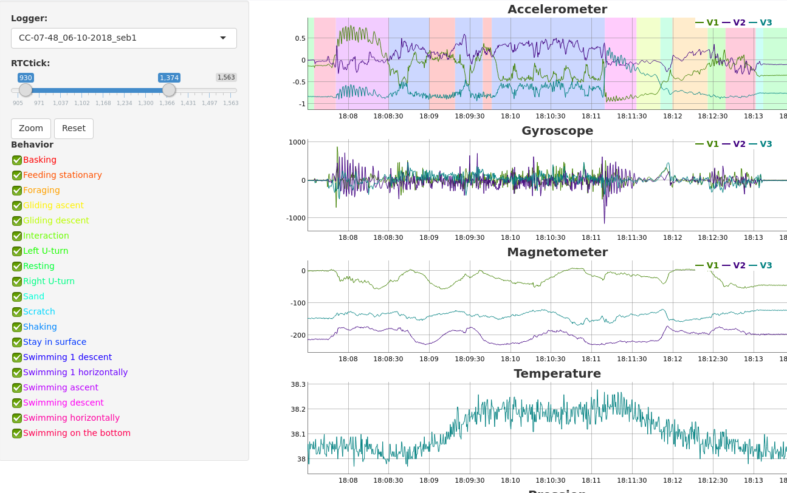

```{r setup, include = FALSE}
knitr::opts_chunk$set(
  collapse = TRUE,
  comment = "#>"
)
```

Le package rblt R-bio-logging-toolbox est une application R-shiny de visualisation des données accéléros des bio-loggers AXYTREK, CATS, et des bio-loggers LUL et WACU, fabriqués par le service MIBE de l’IPHC 

Il est possible d’associé à ces données la vision des comportements des animaux enregistrés depuis le logiciel BORIS http://www.boris.unito.it/ 




# Installation
2 versions sont disponibles

## Version CRAN
Version stable en cours de soumission a CRAN
```
install.packages(rblt)
```
## Version de développement
Version de développement accessible depuis github.
```
install.packages("devtools")
devtools::install_github("sg4r/rblt")
```
# Démonstration
Visualisation des métrics depuis un Bio-loggers CATS, AXYTREK, LUL et WACU.
Les données sont simulées pour avoir un apercus des fonctions de visualisations.
```
library(rblt)
rblt::demo_gui()
````
# Utilisation
Créer un objet de la classe LoggerList qui va contenir la listes des fichiers de données a visualiser. Puis créer une vue avec l'object de la classe LoggerUI qui affichera les différentes données.
```
library(rblt)

cdemo10k="~/rtoolbox/democats-10k.h5"
l=LoggerList$new()
l$add(LoggerCats$new("~/rtoolbox/CC-07-48_14-02-2017_1.h5",filebehavior="~/rtoolbox/CC-07-48_14-02-2018.txt"))
l$add(LoggerCats$new("~/rtoolbox/CC-07-48_15-02-2017_1.h5"))
l$add(LoggerCats$new(cdemo10k))
lui=LoggerUI$new(l)
lui$gui()
````

## Utilisation avancée :
Différents exemples d'utilisation avancée

### Préinitialiser la zone d'affichage
Il est possible de définir la zone d'affichage en initilisant les variables 'uizoomstart' et 'uizoomend' avec les valeurs ntrick

```
ll=LoggerList$new()
ll$add(LoggerCats$new(cdemo10k, uizoomstart=1, uizoomend=500))
lui=LoggerUI$new(ll)
lui$gui()
```
### changer la saturation des couleurs des comportements
Pour augmenter la saturation des couleurs des comportements, utiliser la variable 'besaturation'. la valeur doit entre comprise en 0.1 et 1.0. elle est de 0.2 par defaut.

```
library(rblt)
cdemo10k="~/rtoolbox/democats-10k.h5"
cdemo10kbe="~/rtoolbox/democats-10kbe.csv"
ll=LoggerList$new()
ll$add(LoggerCats$new(cdemo10k,filebehavior=cdemo10kbe, besaturation=1.0, uizoomstart=1, uizoomend=25))
lui=LoggerUI$new(ll)
lui$gui()
```

### Afficher la liste des metrics d'un logger
chaque type de Logger a des metrics par defaut. il est possible d'afficher la liste de metrics avec le commande metriclst draw
```
lg=LoggerCats$new(cdemo10k)
lg$metriclst$draw()
```
## Sélection des metrics à afficher par défaut
Par défaut tous les métrics du type de Bio-loggers sont affichés.
Il est possible de limiter les métrics afficher en définissant le vecteur 'metricshow' lors de l'initialisation d'un bio-logger
Utiliser T pour afficher le métric, et F pour le cacher
```
ll=LoggerList$new()
ll$add(LoggerCats$new("~/rtoolbox/democats2h5.h5",metricshow=c(T,F,T,F,F,F)))
#affichage des informations
ui=LoggerUI$new(ll)
ui$gui()
```

### Changer la liste des metrics d'un logger
Il est possible de redéfinir l'ordre affichage des metrics, sous reserve d'avoir bien indiqué les bons parramétres.
Pour cela il est nécéssaire de redéfinir la liste de metrics a afficher et leur ordre. Lorsque le boolean 'beobs' est définit a 'TRUE' les comportements sont affichés pour ce metric.
```
lg=LoggerCats$new(cdemo10k,filebehavior=cdemo10kbe)
lg$metriclst$draw()

lm=MetricList$new()
lm$add(Metric("Gyroscope",4,3,beobs=TRUE))
lm$add(Metric("Magnetometer",7,3))
lm$add(Metric("Accelerometer",1,3,beobs=TRUE))
lg$metriclst=lm

ll=LoggerList$new()
ll$add(lg)
#affichage des informations
ui=LoggerUI$new(ll)
ui$gui()
```
### Acces aux données
Utiliser getdata() pour avoir une copie de la matrice des données
```
lg=LoggerCats$new(cdemo10k)
lm=lg$getdata()
head(lm)
```

### Ajout d'un metric
réccuperer les données, puis réaliser divers calcul sur la matrice. Il est possible de visualiser les nouveaux metrics en rajoutant les resultat via la fonction 'Pour rajouter le résultat via 'setextmatrix', puis en ajoutant les informations concernant les metrics via la fonction 'metriclst$add'
Exemple pour calculer la moyenne mobile avec un LoggerCats
```
library(caTools)

lg=LoggerCats$new(cdemo10k)
lm=lg$getdata()
lt=lm[,"l"]
ltrm5=runmean(lt, 5)
ltrm10=runmean(lt, 10)
ltrm20=runmean(lt, 20)
extm=cbind(lt,ltrm5,ltrm10,ltrm20)
lg$setextmatrix(extm)
lg$metriclst$add(Metric(name="RunMeanLight",colid=1,colnb=4,srcin=FALSE))
#creation de la liste des logger a afficher
ll=LoggerList$new()
ll$add(lg)
#affichage des informations
ui=LoggerUI$new(ll)
ui$gui()
```
### Enregistrement des metrics
A partir de la version 0.4, il est possible d'enregistrer une selection des metrics dans un fichier de donné. Les métrics calculés peuvent également être inclus dans la selection.
```
#utiliser l'exemple précédant pour calculer la moyenne mobile
metricshow=c(F,F,F,T,F,F,T)
lg$metriclst$slctset(metricshow)
ldata="~/rtoolbox/ldata.h5"
lg$saveasloggerdata(ldata)
```

### Lecture des metrics
Pour relire les donner enregistrer depuis la fonction 'saveasloggerdata' il est nécéssaire d'utiliser le Logger type 'LoggerData'. Le 'LoggerData' est une structure permettant de stocker plusieurs metrics dans un même fichier de donné.
```
ll=LoggerList$new()
ll$add(LoggerData$new(ldata))
#affichage des informations
ui=LoggerUI$new(ll)
ui$gui()
```

# Conversion des données
Le package 'rblt' permet de générer les fichiers données depuis les fichiers brute. Dans la mesure où les différents bio-logger n’utilisent pas le même format de données, il est nécessaire de convertir les données au format utilisé par la librairie 'rblt'.

## Pour les bio-logger CATS :
Convertissez les résultats de vos données au format csv avec la fonction rblt::cats2h5

### Exemple d'importation
```
filecatscsv="~/rtoolbox/20180216-004210-CC-07-48_15-02-2017_1.csv"
filecatsh5="~/rtoolbox/CC-07-48_15-02-2017_1.h5"
rblt::cats2h5(filecatscsv,50,filecatsh5)
[1] "in: ~/rtoolbox/20180216-004210-CC-07-48_15-02-2017_1.csv"
[1] "out: ~/rtoolbox/CC-07-48_15-02-2017_1.h5"
[1] "nbrow: 17099"
filecatscsv="~/rtoolbox/20180214-222647-CC-07-48_14-02-2017_1.csv"
filecatsh5="~/rtoolbox/CC-07-48_14-02-2017_1.h5"
rblt::cats2h5(filecatscsv,50,filecatsh5)
[1] "in: ~/rtoolbox/20180214-222647-CC-07-48_14-02-2017_1.csv"
[1] "out: ~/rtoolbox/CC-07-48_14-02-2017_1.h5"
[1] "nbrow: 5868"
```

### Exemple de visualisation
```
ll=LoggerList$new()
ll$add(LoggerCats$new(fileacatsh5))
#affichage des informations
ui=LoggerUI$new(ll)
ui$gui()
```

## Pour les bio-logger AXYTREK :
Convertissez les résultats de vos données du format csv avec la fonction rblt::axytrek2h5

### Exemple d'imporation
```
atreks1="~/rtoolbox/axytrec-s1.h5"
rblt::axytrek2h5("~/rtoolbox/AXYTREK2_S1.csv",25,atreks1)
[1] "in: ~/rtoolbox/AXYTREK2_S1.csv"
[1] "out: ~/rtoolbox/axytrec-s1.h5"
[1] "nbrow: 670051"
atreks2="~/rtoolbox/axytrec-s2.h5"
rblt::axytrek2h5("~/rtoolbox/AXYTREK5_S1.csv",25,atreks2)
[1] "in: ~/rtoolbox/AXYTREK5_S1.csv"
[1] "out: ~/rtoolbox/axytrec-s2.h5"
[1] "nbrow: 2234282"
```
### Exemple de visualisation
```
ll=LoggerList$new()
ll$add(LoggerAxytrek$new(fileaxyh5))
#affichage des informations
ui=LoggerUI$new(ll)
ui$gui()
```

## Pour les bio-logger LUL :
Convertissez les résultats de vos données du format csv avec la fonction rblt::lul2h5. Attention, le formation csv change en fonction des versions. il est nécéssaire de renseigner le caractère de séparation utilisé.

### Exemple d'importation
```
filelulcsv="~/rtoolbox/lul34.txt"
filelulh5="~/rtoolbox/lul34.h5"
rblt::lul2h5(filelulcsv,filelulh5,sep=";")
```
### Exemple de visualisation
```
ll=LoggerList$new()
ll$add(LoggerLul$new(filelulh5))
#affichage des informations
ui=LoggerUI$new(ll)
ui$gui()
```

## Pour les bio-logger WACU :
Ces bio-loggers fournissent leurs données dans 2 fichiers TXT séparés. Les données TPL et les données ACC. Pour une visualisation détaillé des données accélérométriques, il est nécessaire d'utiliser l'utilitaire wacu2csv pour combiner les fichiers TPL et ACC dans un fichier temporaire, a partir duquel il serra possible d'importer les données combinées.
Pour les fichiers de données de plusieurs mois, il est possible de faire une prévisualisation des données avec une résolution maximale d'une seconde. Cela permet d'avoir une vue d'emble des données rapidement, ainsi que de localiser les zones d'activités. Pour cela utiliser l'option "-p" de l'utilitaire wacu2csv pour combiener les fichiers TPL et ACC avec une résolution d'un seconde. Il peux être envisagé de rajouter une option pour exporter ces zones d'activités.

### Exemple d'importation
```
# combiner les données TPL et ACC
wacu2csv -d ~/rtoolbox/wacu161.txt -a ~/rtoolbox/wacu161_ACC.txt  -o /rtoolbox/w161.csv
#lors du traitement des données, l'utilitaire affichera les informations rtc_period,rtc_ticks et start_at qu'il faudra reporter dans le fonction wacu2h5 sous R
rtc_period:1
rtc_ticks:50
start_at:29/03/2016 00:00:01

# import des données depuis R
filewacucsv="~/rtoolbox/w161.csv"
filewacuh5="~/rtoolbox/wacu161.h5"
datestartstring="29/03/2016 00:00:01"
rblt::wacu2h5(filewacucsv,filewacuh5,rtctick=1, accres=50, datestartstring)
[1] "in: ~/rtoolbox/w161.csv"
[1] "out: ~/rtoolbox/wacu161.h5"
|--------------------------------------------------|
|==================================================|
[1] "29/03/2016 00:00:01"
[1] "nbrow: 64802850"
```
### Exemple de visualisation
```
ll=LoggerList$new()
ll$add(LoggerWacu$new(filewacuh5))
#affichage des informations
ui=LoggerUI$new(ll)
ui$gui()
```

### Exemple de prévisualisation
```
# combiner les données TPL et ACC
wacu2csv -p -d ~/rtoolbox/wacu161.txt -a ~/rtoolbox/wacu161_ACC.txt  -o /rtoolbox/w161.csv
rtc_period:1
rtc_ticks:1
start_at:29/03/2016 00:00:01

#import des données depuis R
filewacucsv="~/rtoolbox/w161.csv"
filewacuh5="~/rtoolbox/wacu161.h5"
datestartstring="29/03/2016 00:00:01"
rblt::wacu2h5(filewacucsv,filewacuh5,rtctick=1, accres=1, datestartstring)
[1] "in: ~/rtoolbox/w161.csv"
[1] "out: ~/rtoolbox/wacu161.h5"
|--------------------------------------------------|
|==================================================|
[1] "29/03/2016 00:00:01"
[1] "nbrow: 1296057"

#visualisation: utiliser la même méthode que précédament.
```


## Conversion des données
Lors de la conversion des données des fichiers CATS ou AXYTREK il est nécessaire d'indiquer pour le moment dans la variable 'accres' la fréquence d'échantillonnage utilisée lors de l'acquisition.
voir les fonction rblt::axytrek2h5 ou rblt::cats2h5

